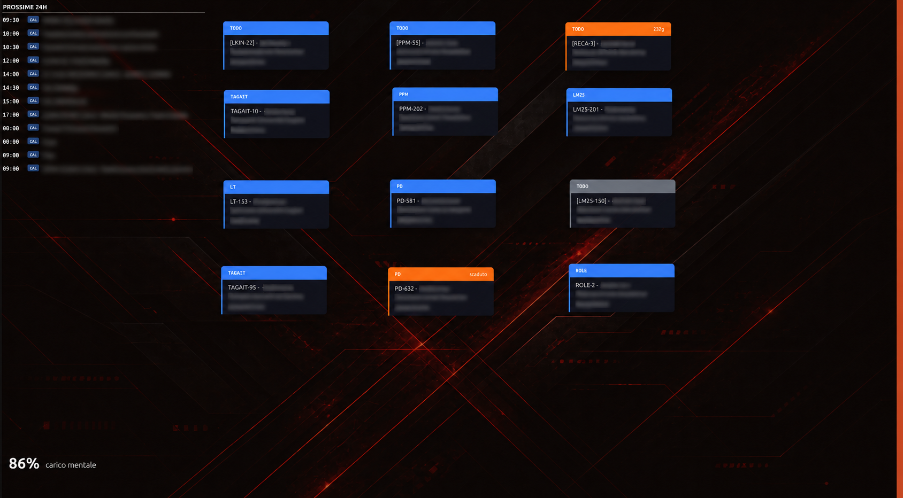
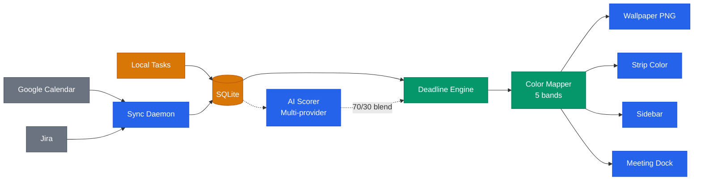
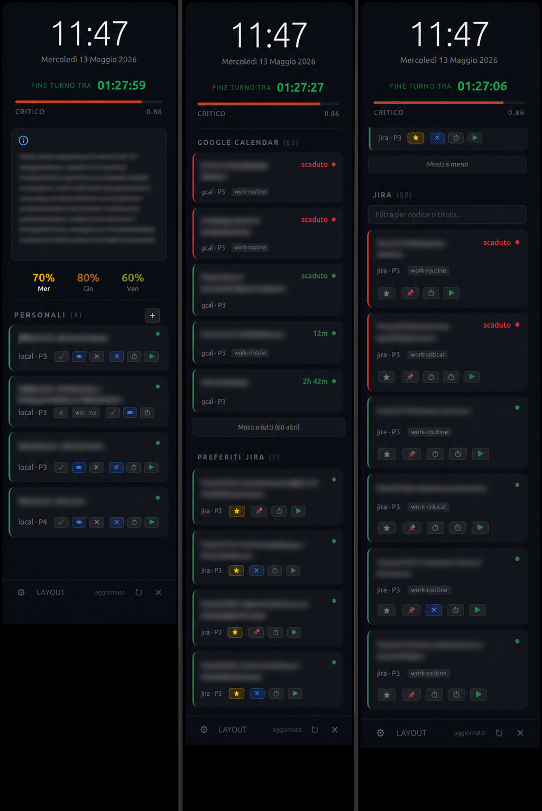
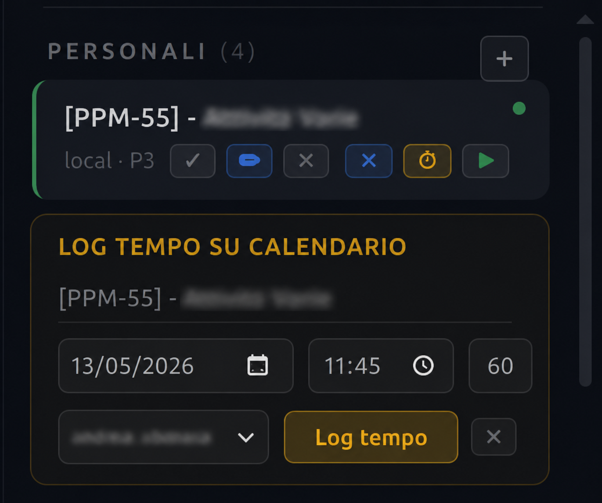
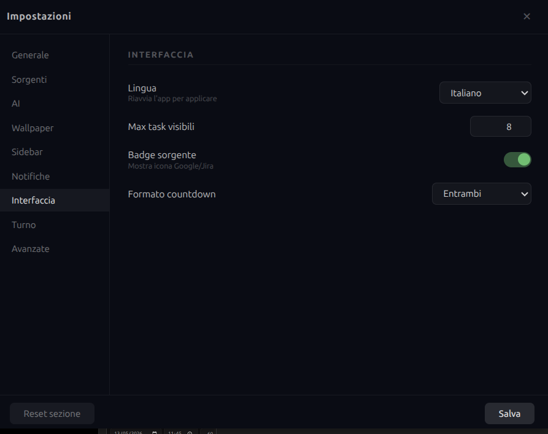

**English** | [Italiano](./README.it.md)

# Deadline Aura by Bonn

Desktop widget for Linux that maps your workload into an ambient visual signal — a colored strip, a tinted wallpaper, and sticky-note tasks that update as deadlines approach.

<div align="center">

[](https://github.com/AndreaBonn/deadline-aura/actions/workflows/ci.yml)
[](https://github.com/AndreaBonn/deadline-aura/actions/workflows/ci.yml)
[](https://github.com/AndreaBonn/deadline-aura/actions/workflows/ci.yml)
[](./LICENSE)
[](https://eslint.org/)
[](https://prettier.io/)
[](./SECURITY.md)
[](https://github.com/AndreaBonn/deadline-aura)

</div>

## What it does

Deadline Aura pulls tasks from Google Calendar and Jira, computes an urgency score for each one, and reflects the aggregate load as color: calm green at low pressure, through yellow, to deep red at critical. The color appears on a persistent sidebar strip on each display, as a wallpaper tint, and optionally as post-it notes rendered directly into the desktop background.

An optional AI scoring layer (Groq, Gemini, OpenAI, or Anthropic) evaluates cognitive and emotional load across the full event window and blends that assessment (70%) with the time-based mechanical score (30%). If no AI provider is configured, the mechanical formula runs alone.

Linux/X11/GNOME only.

<div align="center">

<br><em>Desktop view: colored wallpaper tint, post-it task notes, and the urgency strip on the right edge</em>
</div>

## Architecture



For detailed technical diagrams (sync pipeline, database schema, task lifecycle, IPC), see [docs/ARCHITECTURE.md](./docs/ARCHITECTURE.md).

## Features

- Persistent 20px strip on every connected display; color interpolates across five urgency bands (calm → normal → attention → urgent → critical)
- Sidebar panel with tasks sorted by urgency score, toggled by clicking the strip
- Wallpaper generated as a composite PNG spanning all displays, with per-task post-it notes at drag-and-drop positions stored as percentages
- Urgency engine: exponential decay formula with priority weights and volume amplification above 5 concurrent events
- AI scoring with provider failover (Groq → Gemini → OpenAI → Anthropic), hash-based cache, configurable refresh interval (default: 6 hours)
- Google Calendar sync via OAuth2 (scope: `calendar` for full read and write access)
- Jira sync via API token with configurable JQL
- Multi-monitor support: one strip per display, single spanned wallpaper PNG
- Config validated with Zod on startup and on every settings save
- X11 strut reservation so the strip does not overlap the GNOME work area
- Local tasks: create, edit, complete, and delete personal tasks directly from the sidebar — no external sync needed
- Burnout early warning: analyzes 7 days of AI scoring history across three independent triggers (sustained stress, insufficient recovery, high emotional load) and fires desktop notifications at moderate/high severity
- AI clinical note: natural-language assessment from a simulated occupational psychologist, plus a 5-day stress forecast chart — both visible in a collapsible panel toggled by clicking the urgency bar
- Desktop notifications via `notify-send` with configurable score threshold and cooldown; critical urgency for burnout alerts
- Bilingual interface (Italian/English) switchable from settings; translations loaded via IPC with dot-notation keys and placeholder interpolation
- Settings panel with 9 configuration tabs (General, Sources, AI, Wallpaper, Sidebar, Notifications, Interface, Shift, Advanced) and per-section reset
- Auto-show sidebar on any display with no visible windows (detected via `wmctrl`)
- Single-instance lock prevents duplicate widget processes
- Dynamic lookahead window: events fetched for at least 7 days ahead, extended to the following Sunday; Jira and local tasks are always included regardless of due date
- Jira favorites: star any Jira task to pin it in a dedicated "Favorites" section between Google Calendar and Jira in the sidebar; favorites persist across restarts
- Time logging to Google Calendar: clock button on any task opens an inline form to create a calendar event with date, time, duration, and target calendar; events are formatted as `[JIRA-KEY] - Title` for compatibility with Tempo time tracking
- Live timer: play/stop button on any Jira or local task starts a real-time timer that creates a Google Calendar event immediately and updates its end time every 60 seconds; pressing stop finalizes the event with the exact duration. Timer state persists in localStorage for crash recovery. An "In Progress" section at the top of the sidebar highlights the currently timed task

## Setup

### Step 1 — Install system dependencies

**Ubuntu/Debian:**

```bash
sudo apt install build-essential libcairo2-dev libpango1.0-dev libjpeg-dev libgif-dev librsvg2-dev
sudo apt install x11-utils wmctrl libnotify-bin
```

**Fedora:**

```bash
sudo dnf install gcc-c++ cairo-devel pango-devel libjpeg-turbo-devel giflib-devel librsvg2-devel
sudo dnf install xprop wmctrl libnotify
```

`xprop` and `wmctrl` are required at runtime. The wallpaper is set via `gsettings` (GNOME); `feh` is used as a fallback. `notify-send` handles desktop notifications.

### Step 2 — Install Node.js 20 via nvm

The `canvas` package does not compile on Node 24. Node 20 LTS is required.

If you don't have nvm: [https://github.com/nvm-sh/nvm#installing-and-updating](https://github.com/nvm-sh/nvm#installing-and-updating)

```bash
nvm install 20
nvm use 20
node --version   # should print v20.x.x
```

### Step 3 — Clone and build

```bash
git clone https://github.com/AndreaBonn/deadline-aura.git
cd deadline-aura
npm install
npx electron-rebuild   # rebuilds better-sqlite3 and canvas against Electron's Node ABI
```

`npx electron-rebuild` is required after `npm install`. It recompiles the native addons (`better-sqlite3`, `canvas`) against the Node version embedded in Electron. Without this step, the app will fail to start.

### Step 4 — Create Google Cloud credentials

Deadline Aura needs OAuth 2.0 credentials to read your Google Calendar.

1. Go to [Google Cloud Console](https://console.cloud.google.com) and create a new project (or use an existing one)
2. In the left menu: **APIs & Services → Library** → search for "Google Calendar API" → Enable it
3. Go to **APIs & Services → Credentials** → **Create Credentials → OAuth client ID**
4. Choose application type: **Desktop app**
5. Under **Authorized redirect URIs**, add exactly: `http://localhost:34567/oauth/callback`
6. Click Create — note the **Client ID** and **Client Secret**

### Step 5 — Create the .env file

In the project root, create a file named `.env`:

```dotenv
# Google Calendar OAuth credentials (required for calendar sync)
GOOGLE_CLIENT_ID=paste_your_client_id_here
GOOGLE_CLIENT_SECRET=paste_your_client_secret_here

# AI provider API keys — comma-separated to enable key rotation
# All optional. If none are set, AI scoring is disabled.
GROQ_API_KEYS=key1,key2
GEMINI_API_KEYS=key1
OPENAI_API_KEYS=key1
ANTHROPIC_API_KEYS=key1
```

Fill in at minimum `GOOGLE_CLIENT_ID` and `GOOGLE_CLIENT_SECRET`. The AI keys are optional.

### Step 6 — First run and Google authorization

```bash
nvm use 20
npm start
```

On first run, a browser window opens for Google Calendar authorization. The app requests full calendar access (read and write) so it can both read events and create time log entries. Log in with the Google account whose calendar you want to sync and click Allow. The token is saved automatically to `~/.config/deadlineaura/google-token.json` with permissions `0600`. You will not be asked again unless the token is deleted or revoked.

After authorization, the colored strip appears on the right edge of each display. Click it to open the sidebar.

### Step 7 — Configure Jira (optional)

Click the gear icon in the sidebar to open the settings panel. In the Jira section, enter:

- **Domain**: your Atlassian domain (e.g. `yourcompany.atlassian.net`)
- **Email**: the email address of your Atlassian account
- **API token**: generate one at [https://id.atlassian.com/manage-profile/security/api-tokens](https://id.atlassian.com/manage-profile/security/api-tokens)
- **JQL**: filter for the issues you want to track (default: `assignee = currentUser() AND statusCategory != Done`)

Credentials are stored in `~/.config/deadlineaura/config.json`, which is set to permissions `0600` on every save — readable only by your user account. This is the same security model used for the Google OAuth token at `~/.config/deadlineaura/google-token.json`. The file is local to the machine and is never transmitted.

### Step 8 — Autostart (optional)

**GNOME autostart — launch the widget on login:**

Run these commands from inside the project directory:

```bash
mkdir -p ~/.config/autostart
ELECTRON_BIN=$(node -e "console.log(require('electron'))")
PROJECT_DIR=$(realpath .)

sed "s|Exec=.*|Exec=$ELECTRON_BIN $PROJECT_DIR --no-sandbox|" \
  autostart/deadlineaura.desktop > ~/.config/autostart/deadlineaura.desktop
```

**Systemd timer — background sync every 5 minutes:**

```bash
mkdir -p ~/.config/systemd/user
NODE_BIN=$(which node)
PROJECT_DIR=$(realpath .)

sed "s|ExecStart=.*|ExecStart=$NODE_BIN $PROJECT_DIR/core/sync-daemon.js|" \
  systemd/deadlineaura-sync.service > ~/.config/systemd/user/deadlineaura-sync.service

cp systemd/deadlineaura-sync.timer ~/.config/systemd/user/

systemctl --user daemon-reload
systemctl --user enable --now deadlineaura-sync.timer
```

## Usage

After starting the app (`npm start`), a colored strip appears on the right edge of each display. The color reflects your current workload: green when calm, yellow at moderate load, red at critical pressure. The strip updates automatically every 60 seconds.

### Sidebar

Click the strip to open the sidebar. It shows your tasks grouped into sections:

<div align="center">

<br><em>Sidebar: AI clinical note, stress forecast, task sections with urgency scores, and action buttons</em>
</div>

1. **Local** - personal tasks you create directly in the app
2. **Google Calendar** - upcoming events from your synced calendars
3. **Jira Favorites** - Jira tasks you have starred (appears only if you have favorites)
4. **Jira** - tasks matching your configured JQL filter

Each task card shows title, countdown to deadline, urgency score, and source badge. Click any Jira or Google Calendar task to open it in the browser.

At the top of the sidebar you will find buttons for manual sync, settings (gear icon), post-it layout (grid icon), and close (X).

### Local tasks

Click the **+** button in the "Local" section header to create a personal task. Fill in the title, due date, and priority (P1-P4). Press Enter or click "Add" to save.

On each local task card you can: edit (pencil icon), complete (checkmark), delete (X), pin to desktop, or log time.

### Jira favorites

Click the star icon on any Jira task card to add it to your favorites. Starred tasks appear in a dedicated "Jira Favorites" section at the top of the sidebar, so you can access your most important tasks without scrolling. Click the star again to remove a task from favorites.

### Post-it notes on the desktop

Pin any task to the desktop by clicking the pin icon on its card. The task appears as a post-it note rendered directly into the wallpaper.

To reposition post-it notes: click the layout icon (grid) in the sidebar header. A transparent overlay opens where you can drag each post-it to the desired position. Click "Save" to apply, or press Escape to cancel. Positions are stored as percentages, so they adapt to any screen resolution.

### Time logging to Google Calendar

Click the clock icon on any task card to open the time log form. The form lets you set:

- **Date and time** (defaults to now, rounded to the nearest 15 minutes)
- **Duration** in minutes (15-480, in 15-minute steps)
- **Target calendar** (selected from your writable Google Calendars)

The created event is formatted as `[JIRA-KEY] - Task Title`, compatible with Tempo and other Jira time tracking tools. The calendar you choose is saved as default for future logs.

<div align="center">

<br><em>Inline time log form: date, time, duration, and target calendar</em>
</div>

For local tasks that don't have a Jira key in the title, you can either select an existing Jira task from a dropdown or type a code manually.

After logging, the clock icon briefly shows a green checkmark, then returns to normal so you can log again.

### Live timer

Next to the clock icon, each Jira and local task has a green play button. Click it to start a live timer:

1. **Starting**: press the play button (▶). If no default calendar is set, a small picker appears to select one. For local tasks without a Jira key, you are prompted to associate one first.
2. **Running**: the play button is replaced by a red stop button showing elapsed time (e.g. ■ 00:12:34). A Google Calendar event is created immediately with a default duration of 30 minutes and updated every 60 seconds.
3. **Stopping**: press the stop button. The calendar event is finalized with the exact duration. A green checkmark confirms success.

While a timer is running, the task appears in a dedicated **In Progress** section at the top of the sidebar, before all other sections. Only one timer can be active at a time - starting a new one automatically stops the previous.

If the app closes while a timer is running, it resumes automatically on next launch (timer state is persisted in localStorage).

### AI notes and burnout detection

Click the colored urgency bar at the top of the sidebar to expand the AI panel. It shows:

- A clinical note written in natural language, assessing your cognitive and emotional load
- A 5-day stress forecast chart

The burnout detector runs automatically in the background, analyzing 7 days of AI scoring history. If it detects sustained stress, insufficient recovery, or high emotional load, a desktop notification is sent. No configuration is needed - it works out of the box. You can adjust notification thresholds in the settings.

### Settings

Click the gear icon in the sidebar to open the settings panel. It has 9 tabs:

<div align="center">

<br><em>Settings panel: 9 configuration tabs with per-section reset</em>
</div>

| Tab           | What you can configure                                          |
| ------------- | --------------------------------------------------------------- |
| General       | Sync interval, lookahead window                                 |
| Sources       | Google Calendar calendars and keywords, Jira instances and JQL  |
| AI            | Provider priority order, refresh interval, timeout, temperature |
| Wallpaper     | Enable/disable, background images, post-it settings             |
| Sidebar       | Position (left/right), width, opacity                           |
| Notifications | Enable/disable, score threshold, cooldown                       |
| Interface     | Language (Italian/English), max tasks shown, countdown format   |
| Shift         | Work days, time slots, holidays, regular/variable shift modes   |
| Advanced      | Urgency engine constants and priority weights                   |

Each tab has a "Reset section" button to restore defaults for that section only.

### Manual sync

To force an immediate sync from the terminal:

```bash
npm run sync
```

### File locations

| Path                                        | Content                   |
| ------------------------------------------- | ------------------------- |
| `~/.config/deadlineaura/config.json`        | User configuration        |
| `~/.config/deadlineaura/google-token.json`  | Google OAuth token (0600) |
| `~/.local/share/deadlineaura/db.sqlite`     | SQLite database           |
| `~/.local/share/deadlineaura/wallpaper.png` | Generated wallpaper       |

The full configuration schema with defaults is in `config/defaults.js`.

## Testing

```bash
npm test                  # run all tests
npm run test:coverage     # run with v8 coverage report
npm run lint              # ESLint
```

Tests run under Node 20 directly (not inside Electron). If you previously ran `npx electron-rebuild` to start the app, the native modules will be compiled for Electron's ABI and `npm test` will fail with a version mismatch. Recompile for Node 20 before running tests:

```bash
nvm use 20
npm rebuild
npm test
```

To return to running the app after testing, recompile for Electron again:

```bash
npx electron-rebuild
npm start
```

Tests are in `test/` and mirror the structure of `core/`, `store/`, `ai/`, `integrations/`, and `renderer/`.

## Architecture decisions

For technical diagrams (sync pipeline, database schema, task lifecycle, IPC communication), see [docs/ARCHITECTURE.md](./docs/ARCHITECTURE.md).

## Contributing

Open an issue to discuss changes before submitting a pull request. Code must pass `npm run lint` and `npm test` before review. There is no formal contributing guide at this stage.

## Security

To report a vulnerability, see [SECURITY.md](./SECURITY.md).

## License

Released under the [Apache License 2.0](./LICENSE).

Commercial use is permitted. If you use Deadline Aura in a commercial product or service, attribution to the original author is required per the license terms.

## Author

Andrea Bonacci — [@AndreaBonn](https://github.com/AndreaBonn)

---

If this project is useful to you, a [star on GitHub](https://github.com/AndreaBonn/deadline-aura) helps others find it.
