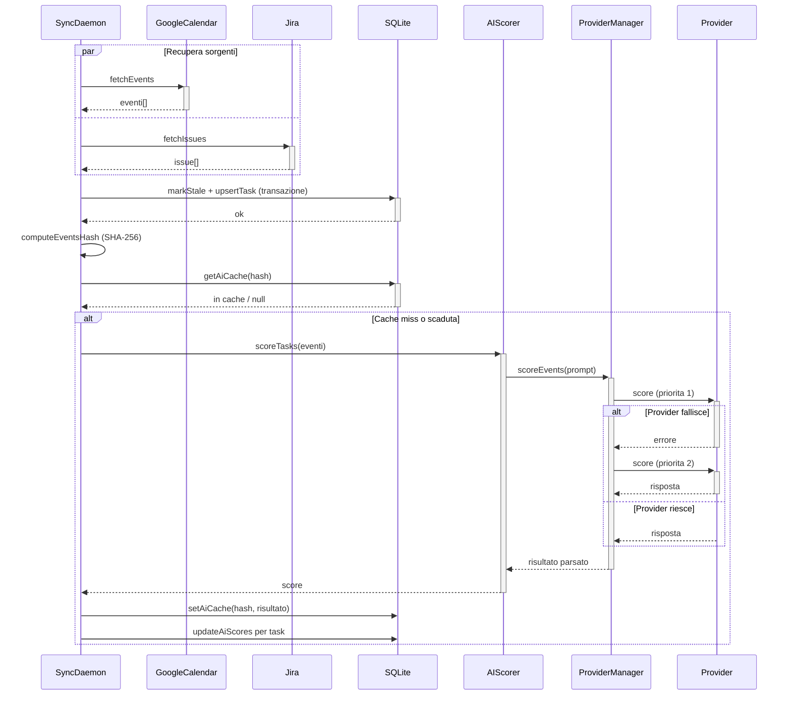
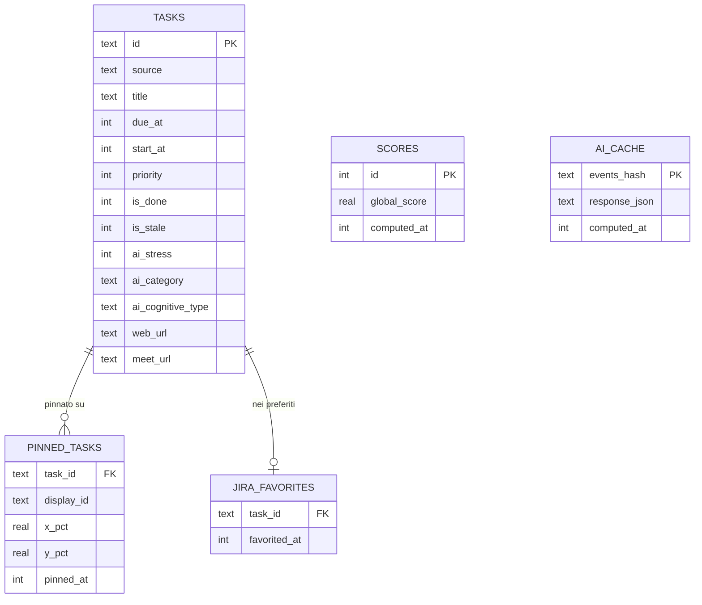
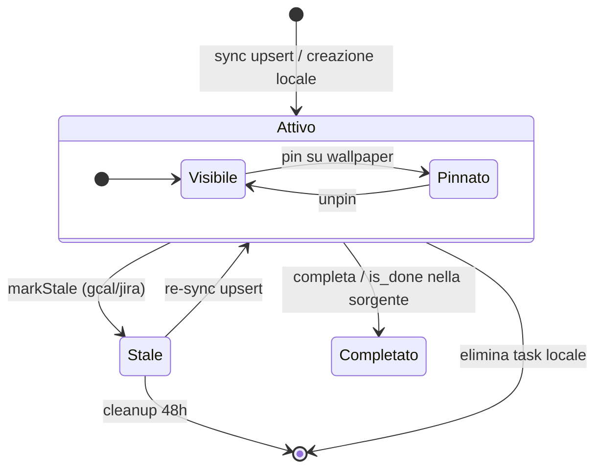
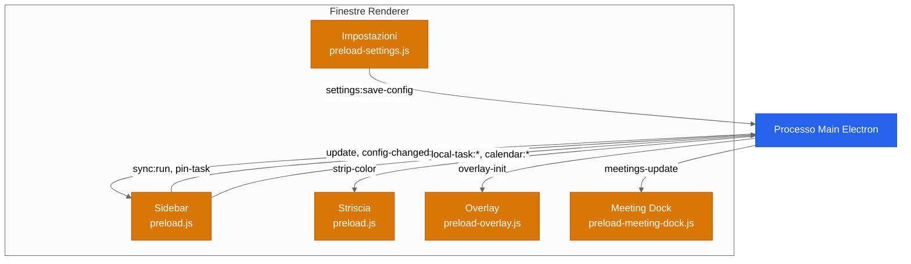

[English](./ARCHITECTURE.md) | [Italiano](./ARCHITECTURE.it.md)

# Architettura

Diagrammi tecnici degli internals di DeadlineAura. Per una panoramica ad alto livello, vedi il [README](../README.it.md#architettura).

## Pipeline Sync e AI Scoring

Il sync daemon recupera eventi da Google Calendar e Jira in parallelo, li persiste in SQLite, poi avvia l'AI scoring se il set di eventi e cambiato (cache basata su hash) o l'ultimo score e piu vecchio dell'intervallo configurato (default: 6 ore). L'AI scorer prova i provider in ordine di priorita con failover automatico.

File chiave: `core/sync-daemon.js`, `ai/provider-manager.js`, `ai/prompt.js`

## Schema Database

SQLite con WAL mode. Cinque tabelle: `tasks` e l'entita centrale, `pinned_tasks` e `jira_favorites` la referenziano con CASCADE delete. `scores` conserva lo storico del global score (retention 7 giorni). `ai_cache` e indicizzata per hash SHA-256 del set di eventi attivi.

File chiave: `store/db.js`, `store/migrations/`

## Ciclo di Vita dei Task

I task entrano nel sistema via sync (gcal/jira) o creazione locale. I flag `is_stale` e `is_done` determinano la visibilita. I task attivi possono essere pinnati sul wallpaper come post-it. I task stale vengono rimossi dopo 48 ore. I task locali possono essere eliminati direttamente (hard delete).

File chiave: `core/sync-daemon.js`, `store/local-queries.js`, `store/pinned-queries.js`

## Comunicazione IPC

Il processo main di Electron comunica con cinque finestre renderer attraverso quattro preload bridge separati (`contextIsolation: true`). I canali push (main verso renderer) consegnano aggiornamenti di stato. I canali request (renderer verso main) gestiscono le azioni utente e le coppie invoke/handle.

File chiave: `main.js`, `preload.js`, `preload-settings.js`, `preload-overlay.js`, `preload-meeting-dock.js`
