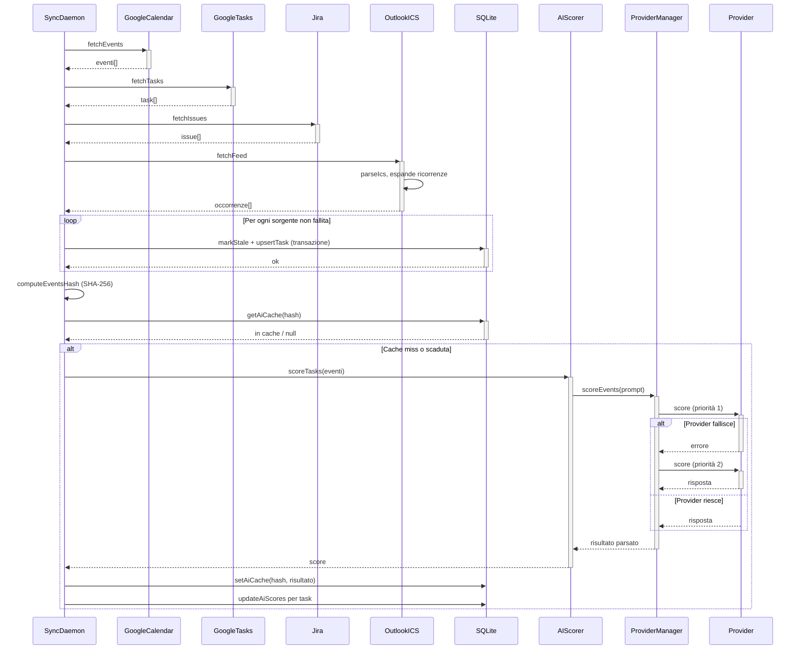
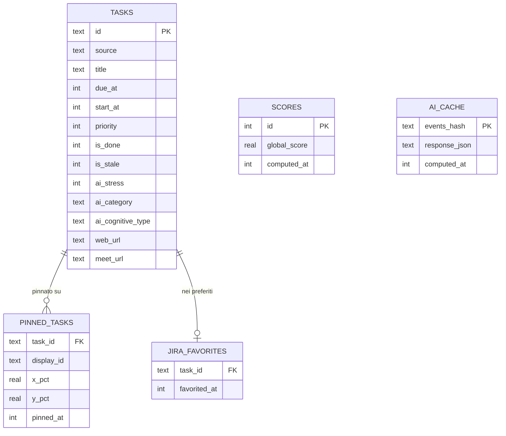
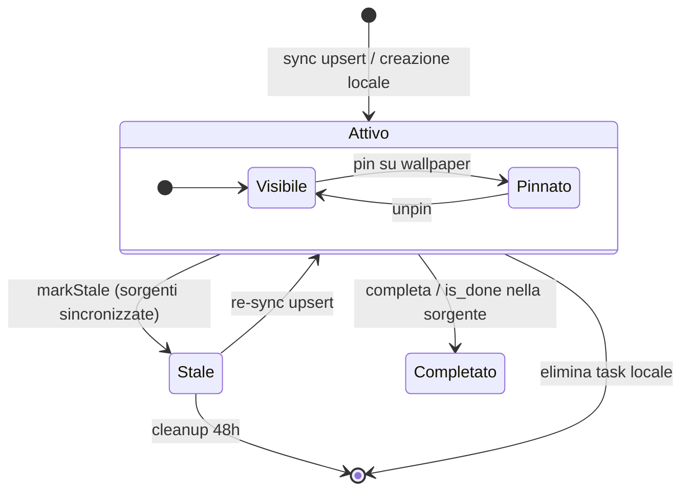
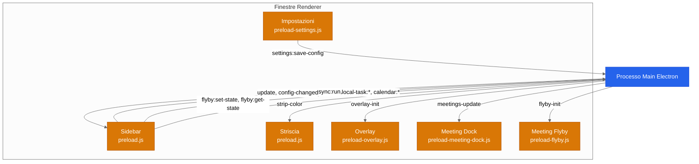

[English](./ARCHITECTURE.md) | [Italiano](./ARCHITECTURE.it.md)

# Architettura

Diagrammi tecnici degli internals di DeadlineAura. Per una panoramica ad alto livello, vedi il [README](../README.it.md#architettura).

## Pipeline Sync e AI Scoring

Il sync daemon interroga le quattro sorgenti una dopo l'altra, persiste in SQLite quello che è tornato indietro, poi avvia l'AI scoring se il set di eventi è cambiato (cache basata su hash) o l'ultimo score è più vecchio dell'intervallo configurato (default: 6 ore). L'AI scorer prova i provider in ordine di priorità con failover automatico.

Ogni fetch è avvolto in `fetchWithErrorCapture`, quindi una sorgente irraggiungibile registra un errore e lascia intatte le altre. La persistenza è poi condizionata: solo le sorgenti che hanno risposto vengono marcate stale e riscritte, così un guasto di rete non cancella dal desktop i task di quella sorgente.

Outlook è l'unica sorgente che non è un client API. Scarica il documento ICS pubblicato e lo espande in locale (`core/ics-parser.js`), trasformando ogni occorrenza di una serie ricorrente in un task a sé, applicando le eccezioni e scartando le cancellazioni.

```mermaid
sequenceDiagram
  participant sd as SyncDaemon
  participant gcal as GoogleCalendar
  participant gtasks as GoogleTasks
  participant jira as Jira
  participant outlook as OutlookICS
  participant db as SQLite
  participant ai as AIScorer
  participant pm as ProviderManager
  participant prov as Provider

  sd->>+gcal: fetchEvents
  gcal-->>-sd: eventi[]

  sd->>+gtasks: fetchTasks
  gtasks-->>-sd: task[]

  sd->>+jira: fetchIssues
  jira-->>-sd: issue[]

  sd->>+outlook: fetchFeed
  outlook->>outlook: parseIcs, espande ricorrenze
  outlook-->>-sd: occorrenze[]

  loop Per ogni sorgente non fallita
    sd->>+db: markStale + upsertTask (transazione)
    db-->>-sd: ok
  end

  sd->>sd: computeEventsHash (SHA-256)
  sd->>+db: getAiCache(hash)
  db-->>-sd: in cache / null

  alt Cache miss o scaduta
    sd->>+ai: scoreTasks(eventi)
    ai->>+pm: scoreEvents(prompt)
    pm->>+prov: score (priorità 1)

    alt Provider fallisce
      prov-->>-pm: errore
      pm->>+prov: score (priorità 2)
      prov-->>-pm: risposta
    else Provider riesce
      prov-->>pm: risposta
    end

    pm-->>-ai: risultato parsato
    ai-->>-sd: score

    sd->>db: setAiCache(hash, risultato)
    sd->>db: updateAiScores per task
  end
```

File chiave: `core/sync-daemon.js`, `integrations/outlook.js`, `core/ics-parser.js`, `ai/provider-manager.js`, `ai/prompt.js`

## Schema Database

SQLite con WAL mode. Cinque tabelle: `tasks` è l'entità centrale, `pinned_tasks` e `jira_favorites` la referenziano con CASCADE delete. `scores` conserva lo storico del global score (retention 7 giorni). `ai_cache` è indicizzata per hash SHA-256 del set di eventi attivi.

La colonna `source` porta un vincolo CHECK che elenca i valori ammessi, oggi `gcal`, `gtasks`, `jira`, `local` e `outlook`. SQLite non sa modificare un vincolo sul posto, quindi ogni nuova sorgente comporta la ricostruzione della tabella: le migrazioni in `store/db.js` lo fanno in modo idempotente, copiando le righe e facendo prima uno snapshot del database (`store/db-backup.js`). Un backup fallito interrompe la migrazione.

Non tutte le sorgenti riempiono tutte le colonne. `start_at` viene valorizzata dagli eventi di calendario (`gcal`, `outlook`) e resta nulla per gli elementi di backlog; `web_url` è nulla per Outlook, perché un feed pubblicato non porta con sé una pagina per singolo evento; `meet_url` contiene il link alla videochiamata quando ne è stato trovato uno nell'evento.

```mermaid
erDiagram
  TASKS {
    text id PK
    text source
    text title
    int due_at
    int start_at
    int priority
    int is_done
    int is_stale
    int ai_stress
    text ai_category
    text ai_cognitive_type
    text web_url
    text meet_url
  }

  SCORES {
    int id PK
    real global_score
    int computed_at
  }

  AI_CACHE {
    text events_hash PK
    text response_json
    int computed_at
  }

  PINNED_TASKS {
    text task_id FK
    text display_id
    real x_pct
    real y_pct
    int pinned_at
  }

  JIRA_FAVORITES {
    text task_id FK
    int favorited_at
  }

  TASKS ||--o{ PINNED_TASKS : "pinnato su"
  TASKS ||--o| JIRA_FAVORITES : "nei preferiti"
```

File chiave: `store/db.js`, `store/migrations/`

## Ciclo di Vita dei Task

I task entrano nel sistema tramite sync (`gcal`, `gtasks`, `jira`, `outlook`) o creazione locale. I flag `is_stale` e `is_done` determinano la visibilità. I task attivi possono essere pinnati sul wallpaper come post-it. I task stale vengono rimossi dopo 48 ore. I task locali possono essere eliminati direttamente (hard delete).

```mermaid
stateDiagram-v2
  [*] --> Attivo : sync upsert / creazione locale

  Attivo --> Stale : markStale (sorgenti sincronizzate)
  Stale --> Attivo : re-sync upsert
  Attivo --> Completato : completa / is_done nella sorgente
  Attivo --> [*] : elimina task locale
  Stale --> [*] : cleanup 48h

  state Attivo {
    direction LR
    [*] --> Visibile
    Visibile --> Pinnato : pin su wallpaper
    Pinnato --> Visibile : unpin
  }
```

File chiave: `core/sync-daemon.js`, `store/local-queries.js`, `store/pinned-queries.js`

## Comunicazione IPC

Il processo main di Electron comunica con sei finestre renderer attraverso cinque preload bridge separati (`contextIsolation: true`). I canali push (main verso renderer) consegnano aggiornamenti di stato. I canali request (renderer verso main) gestiscono le azioni utente e le coppie invoke/handle.

```mermaid
%%{init: {'theme': 'neutral'}}%%
graph TD
  main["Processo Main Electron"]

  subgraph renderers["Finestre Renderer"]
    sidebar["Sidebar<br/>preload.js"]
    strip["Striscia<br/>preload.js"]
    overlay["Overlay<br/>preload-overlay.js"]
    settings["Impostazioni<br/>preload-settings.js"]
    meet_dock["Meeting Dock<br/>preload-meeting-dock.js"]
    flyby["Meeting Flyby<br/>preload-flyby.js"]
  end

  main -->|"update, config-changed"| sidebar
  main -->|"strip-color"| strip
  main -->|"overlay-init"| overlay
  main -->|"meetings-update"| meet_dock
  main -->|"flyby-init"| flyby

  sidebar -->|"sync:run, pin-task"| main
  sidebar -->|"local-task:*, calendar:*"| main
  sidebar -->|"flyby:set-state, flyby:get-state"| main
  settings -->|"settings:save-config"| main

  classDef core fill:#2563eb,stroke:#1d4ed8,color:#fff
  classDef data fill:#d97706,stroke:#b45309,color:#fff
  classDef ext fill:#6b7280,stroke:#4b5563,color:#fff

  class main core
  class sidebar,strip,overlay,settings,meet_dock,flyby data
```

Il menu del gatto scrive tramite `flyby:set-state`, che modifica solo il blocco `meeting_flyby` della configurazione invece di salvare l'intero oggetto, così una finestra impostazioni aperta nello stesso momento non sovrascrive la sospensione (`core/flyby-snooze.js`).

File chiave: `main.js`, `preload.js`, `preload-settings.js`, `preload-overlay.js`, `preload-meeting-dock.js`, `preload-flyby.js`
