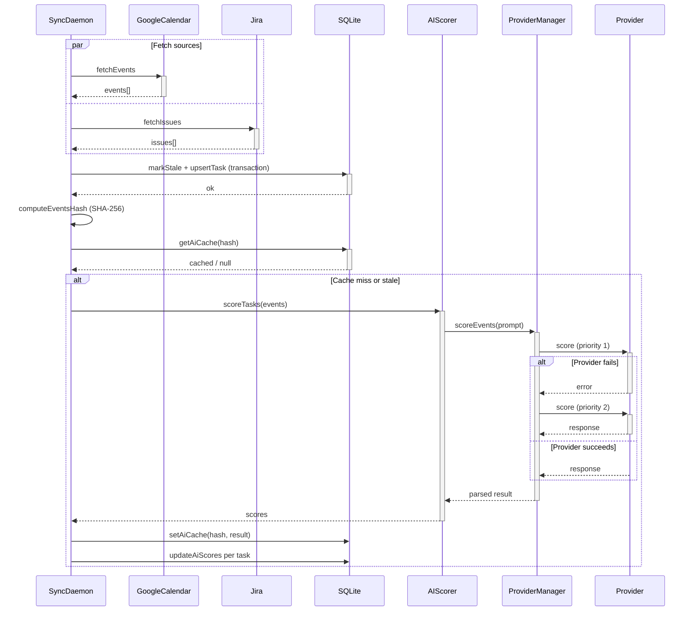
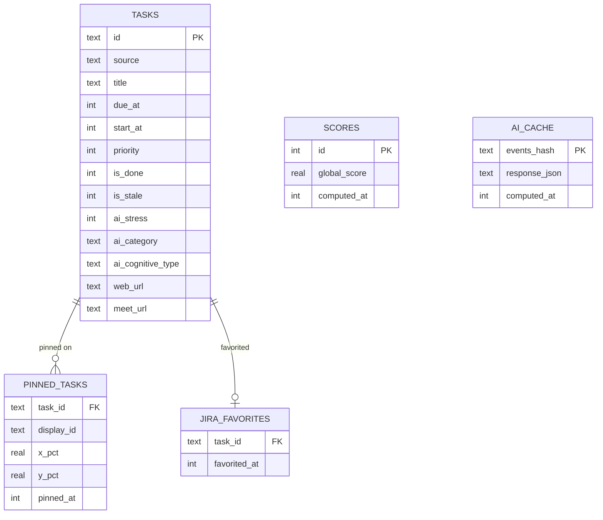
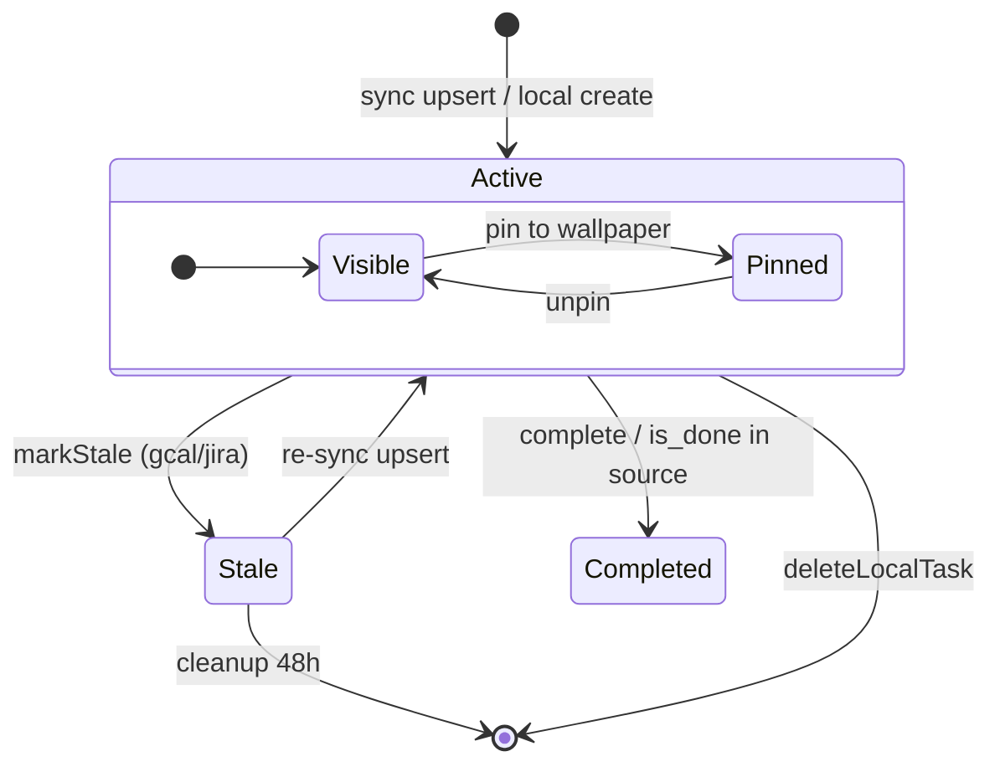
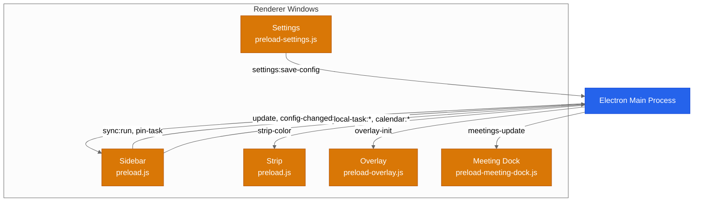

[English](./ARCHITECTURE.md) | [Italiano](./ARCHITECTURE.it.md)

# Architecture

Technical diagrams for DeadlineAura internals. For a high-level overview, see the [README](../README.md#architecture).

## Sync and AI Scoring Pipeline

The sync daemon fetches events from Google Calendar and Jira in parallel, persists them in SQLite, then triggers AI scoring if the event set has changed (hash-based cache) or the last score is older than the configured interval (default: 6 hours). The AI scorer tries providers in priority order with automatic failover.

Key files: `core/sync-daemon.js`, `ai/provider-manager.js`, `ai/prompt.js`

## Database Schema

SQLite with WAL mode. Five tables: `tasks` is the central entity, `pinned_tasks` and `jira_favorites` reference it with CASCADE delete. `scores` stores global score history (7-day retention). `ai_cache` is keyed by SHA-256 hash of the active event set.

Key files: `store/db.js`, `store/migrations/`

## Task Lifecycle

Tasks enter the system via sync (gcal/jira) or local creation. The `is_stale` and `is_done` flags determine visibility. Active tasks can be pinned to the wallpaper as post-it notes. Stale tasks are cleaned up after 48 hours. Local tasks can be deleted directly (hard delete).

Key files: `core/sync-daemon.js`, `store/local-queries.js`, `store/pinned-queries.js`

## IPC Communication

Electron main process communicates with five renderer windows through four separate preload bridges (`contextIsolation: true`). Push channels (main to renderer) deliver state updates. Request channels (renderer to main) handle user actions and invoke/handle pairs.

Key files: `main.js`, `preload.js`, `preload-settings.js`, `preload-overlay.js`, `preload-meeting-dock.js`
