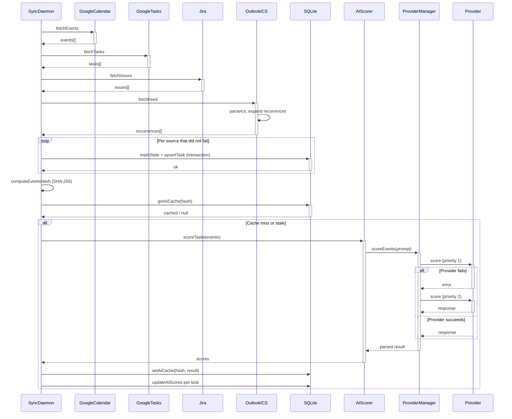
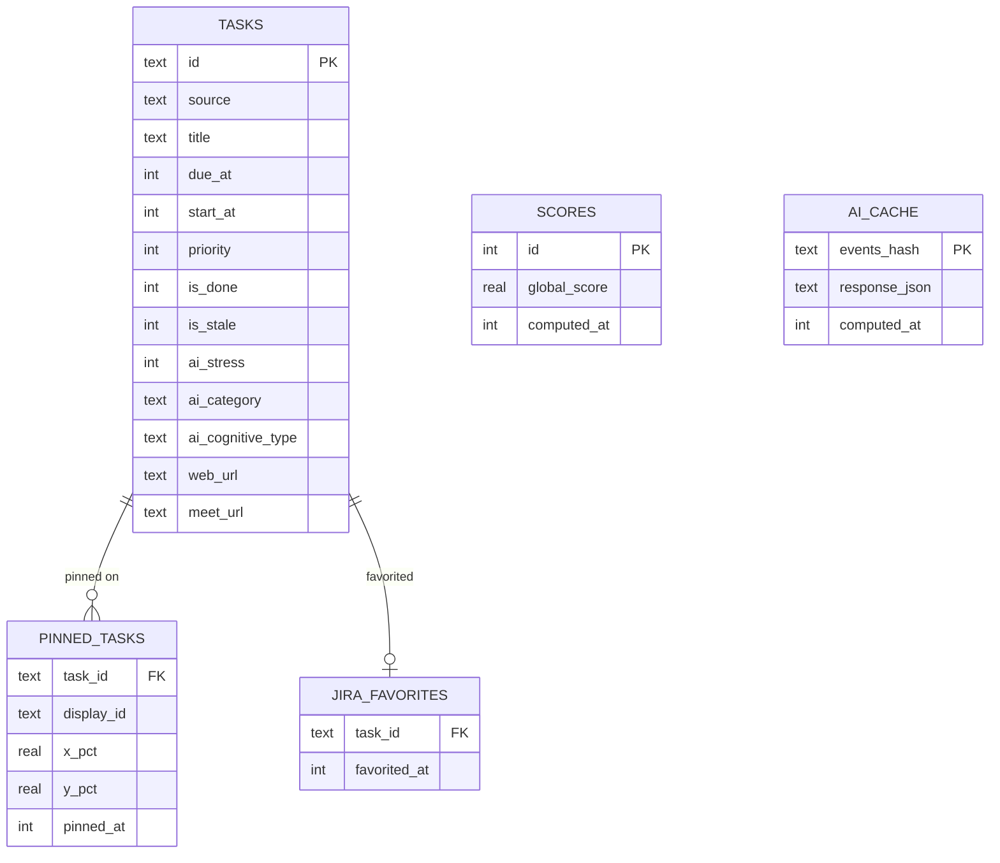
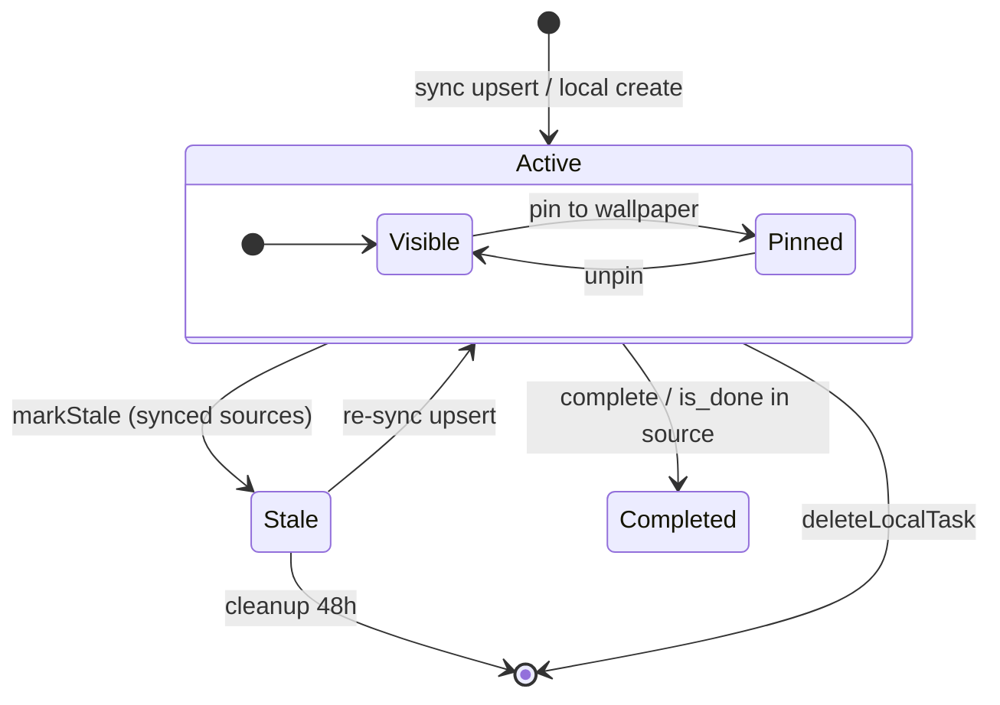
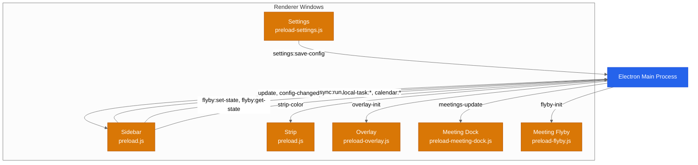

[English](./ARCHITECTURE.md) | [Italiano](./ARCHITECTURE.it.md)

# Architecture

Technical diagrams for DeadlineAura internals. For a high-level overview, see the [README](../README.md#architecture).

## Sync and AI Scoring Pipeline

The sync daemon queries the four sources one after another, persists what came back into SQLite, then triggers AI scoring if the event set has changed (hash-based cache) or the last score is older than the configured interval (default: 6 hours). The AI scorer tries providers in priority order with automatic failover.

Each fetch is wrapped in `fetchWithErrorCapture`, so a source that is down records an error and leaves the others untouched. Persistence is then conditional: only the sources that answered are marked stale and rewritten, which prevents a network failure from wiping a source's tasks off the desktop.

Outlook is the only source that is not an API client. It downloads the published ICS document and expands it locally (`core/ics-parser.js`), turning each occurrence of a recurring series into its own task, applying the exceptions and dropping the cancellations.

```mermaid
sequenceDiagram
  participant sd as SyncDaemon
  participant gcal as GoogleCalendar
  participant gtasks as GoogleTasks
  participant jira as Jira
  participant outlook as OutlookICS
  participant db as SQLite
  participant ai as AIScorer
  participant pm as ProviderManager
  participant prov as Provider

  sd->>+gcal: fetchEvents
  gcal-->>-sd: events[]

  sd->>+gtasks: fetchTasks
  gtasks-->>-sd: tasks[]

  sd->>+jira: fetchIssues
  jira-->>-sd: issues[]

  sd->>+outlook: fetchFeed
  outlook->>outlook: parseIcs, expand recurrences
  outlook-->>-sd: occurrences[]

  loop Per source that did not fail
    sd->>+db: markStale + upsertTask (transaction)
    db-->>-sd: ok
  end

  sd->>sd: computeEventsHash (SHA-256)
  sd->>+db: getAiCache(hash)
  db-->>-sd: cached / null

  alt Cache miss or stale
    sd->>+ai: scoreTasks(events)
    ai->>+pm: scoreEvents(prompt)
    pm->>+prov: score (priority 1)

    alt Provider fails
      prov-->>-pm: error
      pm->>+prov: score (priority 2)
      prov-->>-pm: response
    else Provider succeeds
      prov-->>pm: response
    end

    pm-->>-ai: parsed result
    ai-->>-sd: scores

    sd->>db: setAiCache(hash, result)
    sd->>db: updateAiScores per task
  end
```

Key files: `core/sync-daemon.js`, `integrations/outlook.js`, `core/ics-parser.js`, `ai/provider-manager.js`, `ai/prompt.js`

## Database Schema

SQLite with WAL mode. Five tables: `tasks` is the central entity, `pinned_tasks` and `jira_favorites` reference it with CASCADE delete. `scores` stores global score history (7-day retention). `ai_cache` is keyed by SHA-256 hash of the active event set.

The `source` column carries a CHECK constraint listing the accepted values, currently `gcal`, `gtasks`, `jira`, `local` and `outlook`. SQLite cannot alter a constraint in place, so every new source means rebuilding the table: the migrations in `store/db.js` do it idempotently, copying the rows across and snapshotting the database first (`store/db-backup.js`). A failed backup aborts the migration.

Not every source fills every column. `start_at` is set by calendar events (`gcal`, `outlook`) and left null by backlog items; `web_url` is null for Outlook, because a published feed carries no per-event page; `meet_url` holds the video call link when one was found in the event.

```mermaid
erDiagram
  TASKS {
    text id PK
    text source
    text title
    int due_at
    int start_at
    int priority
    int is_done
    int is_stale
    int ai_stress
    text ai_category
    text ai_cognitive_type
    text web_url
    text meet_url
  }

  SCORES {
    int id PK
    real global_score
    int computed_at
  }

  AI_CACHE {
    text events_hash PK
    text response_json
    int computed_at
  }

  PINNED_TASKS {
    text task_id FK
    text display_id
    real x_pct
    real y_pct
    int pinned_at
  }

  JIRA_FAVORITES {
    text task_id FK
    int favorited_at
  }

  TASKS ||--o{ PINNED_TASKS : "pinned on"
  TASKS ||--o| JIRA_FAVORITES : "favorited"
```

Key files: `store/db.js`, `store/migrations/`

## Task Lifecycle

Tasks enter the system through sync (`gcal`, `gtasks`, `jira`, `outlook`) or local creation. The `is_stale` and `is_done` flags determine visibility. Active tasks can be pinned to the wallpaper as post-it notes. Stale tasks are cleaned up after 48 hours. Local tasks can be deleted directly (hard delete).

```mermaid
stateDiagram-v2
  [*] --> Active : sync upsert / local create

  Active --> Stale : markStale (synced sources)
  Stale --> Active : re-sync upsert
  Active --> Completed : complete / is_done in source
  Active --> [*] : deleteLocalTask
  Stale --> [*] : cleanup 48h

  state Active {
    direction LR
    [*] --> Visible
    Visible --> Pinned : pin to wallpaper
    Pinned --> Visible : unpin
  }
```

Key files: `core/sync-daemon.js`, `store/local-queries.js`, `store/pinned-queries.js`

## IPC Communication

Electron main process communicates with six renderer windows through five separate preload bridges (`contextIsolation: true`). Push channels (main to renderer) deliver state updates. Request channels (renderer to main) handle user actions and invoke/handle pairs.

```mermaid
%%{init: {'theme': 'neutral'}}%%
graph TD
  main["Electron Main Process"]

  subgraph renderers["Renderer Windows"]
    sidebar["Sidebar<br/>preload.js"]
    strip["Strip<br/>preload.js"]
    overlay["Overlay<br/>preload-overlay.js"]
    settings["Settings<br/>preload-settings.js"]
    meet_dock["Meeting Dock<br/>preload-meeting-dock.js"]
    flyby["Meeting Flyby<br/>preload-flyby.js"]
  end

  main -->|"update, config-changed"| sidebar
  main -->|"strip-color"| strip
  main -->|"overlay-init"| overlay
  main -->|"meetings-update"| meet_dock
  main -->|"flyby-init"| flyby

  sidebar -->|"sync:run, pin-task"| main
  sidebar -->|"local-task:*, calendar:*"| main
  sidebar -->|"flyby:set-state, flyby:get-state"| main
  settings -->|"settings:save-config"| main

  classDef core fill:#2563eb,stroke:#1d4ed8,color:#fff
  classDef data fill:#d97706,stroke:#b45309,color:#fff
  classDef ext fill:#6b7280,stroke:#4b5563,color:#fff

  class main core
  class sidebar,strip,overlay,settings,meet_dock,flyby data
```

The cat menu writes through `flyby:set-state`, which patches only the `meeting_flyby` block of the config rather than saving the whole object, so a settings window open at the same time does not overwrite the snooze (`core/flyby-snooze.js`).

Key files: `main.js`, `preload.js`, `preload-settings.js`, `preload-overlay.js`, `preload-meeting-dock.js`, `preload-flyby.js`
